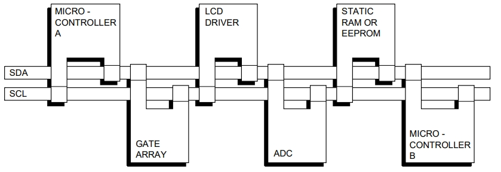

# **I2C总线协议**

## **标准模式、快速模式、快速+模式 I2C总线协议**

串行数据和串行时钟两条线将信息在连接到总线的设备间传递。每个设备都有一个独立的地址来做辨识，且既可以作为发送器也可以作为接收器，这依赖于设备的方法。一个LCD驱动可能只是一个接收者，而一个内存既可以接收数据也可以发送数据。除了发送器和接收器，当执行数据传输时设备也可以被认为是控制器和目标。控制器是总线上启动数据传输并生成时钟信号来许可这种转移的设备。此时，任何被寻址的设备都被认为是目标。

**I2C总线术语**

|Term|Description|
|----|-----------|
|Transmitter|发送数据到总线的设备|
|Receiver|从总线接收数据的设备|
|Controller|开启一个传输，生成一个时钟信号，并结束一个传输的设备|
|Target|被控制器定位的设备|
|Multi-controller|多个控制器可以尝试来同时控制总线且不会损坏消息|
|Arbitration|保证如果多个控制器同时尝试控制总线，只有一个被允许且其消息不会损坏的过程|
|Synchronization|同步两个或多个设备的时钟信号的过程|

I2C总线是一个多控制器总线，这意味着能够控制总线的多个设备可以连接到它。这些控制器通常为微控制器。考虑在两个连接在I2C总线上的微控制器之间的数据传输：

这个例子高亮了 控制器——目标 和 发送器——接收器 在I2C总线上的关系构建。注意这些关系并不是永久的，它们只依赖于当前的数据传输方向。数据的传输将会如下展开：

1. 假设微控制器A想要向微控制器B中发送信息：
- 微控制器A（控制器），定位微控制器B(目标)
- 微控制器A（控制器——发送器），发送数据到微控制器B(目标——接收器)
- 微控制器A（控制器）结束传输
2. 假设微控制器A想要接收微控制器B发送的信息：
- 微控制器A（控制器），定位微控制器B(目标)
- 微控制器A（控制器——接收器），从微控制器B(目标——发送器)接收数据
- 微控制器A（控制器）结束传输

    即使是这种情况，也是控制器（微控制器A）生成时钟并结束传送。

连接多个微控制器到I2C上的可能性意味着可以有多个控制器同时尝试开启数据传送。为避免这种情况下可能发生的混乱制定了仲裁程序。这个程序依赖于所有到I2C总线的I2C接口的[线与](#线与wired-and)连接。

如果两个或多个控制器尝试将信息放置到总线上，第一个产生 1 的控制器将会在另一个产生 0 时失去仲裁。时钟信号在仲裁期间由控制器使用[线与](#线与wired-and)连接到SCL线产生的时钟的同步组合。

在I2C总线上生成时钟信号是控制器的责任；当在总线上传送数据时每个控制器生成其自己的时钟信号。来自控制器的总线时钟信号只能在它们被慢速目标设备按下时钟线或在仲裁发生时由另一个控制器拉伸时被改变。

I2C总线协议特性适用性

M=mandatory; O=optional; n/a=not applicable

|Feature|Single controller|Multi-controller|Target|
|-------|-----------------|----------------|------|
|START condition |M |M |M |
|STOP condition |M |M |M |
|Acknowledge |M |M |M |
|Synchronization |n/a |M |n/a |
|Arbitration |n/a |M |n/a |
|Clock stretching |O |O |O |
|7-bit target address |M |M |M |
|10-bit target address |O |O |O |
|General Call address |O |O |O |
|Software Reset |O |O |O |
|START byte |n/a |O |n/a |
|Device ID |n/a |n/a |O |
    
1. 也适用于控制器作为目标
2. 时钟拉伸在一些目标上是一种特性。如果在系统中没有目标拉伸时钟，控制器就不需要被设计掌握这个程序。
3. [Bit-banging](#bit-banging)(软件模拟)多控制器系统应该考虑一个START字节。

### **SDA 和 SCL 信号**
SDA和SCL都是双向线，通过电流源或上拉电阻连接在正电源电压上。当总线处于空闲状态，两根线都为高电压，连接到总线的设备的输出级必须有一个开路漏极或开路集电极来执行[线与](#线与wired-and)功能。I2C综合险上的数据传输在标准模式下可以达到100kbit/s，在快速模式下可以达到400kbit/s，在快速+模式下可以达到1Mbit/s，在高速模式下可以达到3.4Mbit/s。总线电容限制了连接到总线的接口数量。

### **SDA 和 SCL 逻辑电平**
由于不同的技术设备都可以被连接在I2C总线上，0（LOW）和1（HIGH）的逻辑电平不是固定的，且依赖于$V_{DD}$的相关电平。输入参考电平被设定为$V_{DD}$的30%和70%；$V_{IL}$是$0.3V_{DD}$，$V_{IH}$是$0.7V_{DD}$。一些遗留设备的输入电平被固定在了$V_{IL}=1.5V$和$V_{IH}=3.0V$，但是所有新设备需要这个30%/70%规范。

### **数据有效性**
SDA线上的数据必须在时钟的HIGH时期是稳定的。数据线的HIGH或LOW状态只能在SCL线上的时钟信号为LOW时改变。每传输一个数据位产生一个时钟脉冲。

### **START 和 STOP 条件**
所有处理起始于一个START并且通过一个STOP结束。当SCL为HIGH时一个在SDA线上的HIGH到LOW转变定义了一个START条件，当SCL为HIGH时一个在SDA线上的LOW到HIGH转变定义了一个STOP条件。

START和STOP条件总是被控制器生成，总线在START条件后会被认为处于忙碌状态。

如果重复生成START（Sr）而不是STOP条件，则总线保持忙碌。在这方面，START（S）和重复START（Sr）条件在功能上是相同的。因此，对于本文的其余部分，除非Sr特别相关，否则将S符号用作表示START和重复START条件的通用术语。

### **字节格式**
每个写入SDA总写的字节必须为8比特长。每次传输可以发送的字节数是不限制的。每个字节必须跟着一个ack位。数据从最高有效位开始发送。如果一个目标在完成其他功能之前不能接收或者发送另一完整字节的数据，例如服务一个内部中断，它可以控制时钟线SCL位LOW来强制控制器进入一个等待状态。然后，当目标准备好接收另一个字节数据并释放时钟线SCL时，数据传输继续进行。

### **ACK和非ACK**
ack放置在每一个字节之后。ack位允许接收器向发送器提示字节成功接收且下个字节可以被发送了。
控制器生成所有的时钟脉冲，包括ack的第九个时钟脉冲。

ack信号定义如下：发送器释放SDA线在ack时钟脉冲周期内，因此接收器可以将SDA线拉至低电平并且在SCL为高电平期间将其保持为低电平。设置和保持的时间也必须考虑在内。

当SDA在第九个时钟脉冲时保持在HIGH电平，这定义了not ack信号。控制器这时将会生成一个STOP条件来终止传送，或者重复START条件来开始一个新的传送。如下是五种导致生成NACK的条件：
1. 当前总线上没有发送地址的接收器，因此没有设备回应一个ack。
2. 接收器由于一些实时任务且未做好与控制器开始进行通信的准备，而无法接收或者发送。
3. 在传输期间，接收器获取了它无法理解的数据或命令
4. 在传输期间，接收器接收不到任何字节的数据
5. 一个控制器——接收器必须向目标发送器标记出传输结束信号。

### **信号同步**
两个控制器可以同时在一个空闲的总线上开始发送，且必须有一个方法来决定谁来掌握总线的控制权，并完成它的传输。这个方法通过时钟同步和仲裁实现。在单个控制器系统中，不需要时钟同步和仲裁。

时钟同步是通过I2C接口[线与](#线与wired-and)连接到SCL线来实现的。这意味着一个在SCL线上的HIGH至LOW的变换导致控制器开始计算它们的LOW周期，一旦控制器时钟变为LOW，，它将控制SCL线到这个状态直到时钟到HIGH状态。然而，如果另一个时钟仍在它的LOW周期，那么这个时钟的LOW到HIGH的转换可能不会改变SCL线的状态。SCL线会因为最长的控制器的LOW周期而保持在LOW状态。有较短LOW周期的控制器在这段时间会进入一个HIGH等待状态。

当所有控制器都结束了它们的LOW周期，时钟线被释放并到HIGH周期。如此在控制器时钟之间、SCL线状态以及所有控制器开始其HIGH周期就不再有差异。第一个完成它HIGH周期的控制器将会把SCL线再次拉回LOW状态。

在这种方式下，一个同步SCL时钟的LOW周期由LOW周期最长的控制器决定，其HIGH周期决定于HIGH周期最短的那个。

### **仲裁**
仲裁与同步相似，指仅在系统中使用多个控制器时所需的协议的一部分。目标并不参与仲裁的过程。一个控制器只在总线空闲时可能开启一个传输。两个控制器可能生成一个START条件在START条件的最小保持时间（$t_{HD;STA}$），这可以在总线上完成一个有效的START条件。此时就需要仲裁来确定哪一个控制器将会完成它的传输。

仲裁按bit进行，在每个bit期间，当SCL为HIGH时，每一个控制器检测SDA的电平是否与他们的发送相匹配，这个处理可能需要很多bit。两个控制器实际上可以毫无错误地完成整个业务，只要传输是相同的。第一次一个控制器尝试发送一个HIGH电平，但检测到SDA的电平为LOW，控制器他失去了仲裁并关闭了它的SDA输出驱动。另一个控制器继续完成它的业务。

在整个仲裁期间没有信息会丢失。失去了仲裁的控制器可以生成时钟脉冲直到它丢失仲裁的字节结束并在总线空闲收必须重启它的业务。

如果一个控制器也包含了一个目标函数并且它在寻址阶段失去了仲裁，那可能是获得仲裁的控制器在对它进行寻址。因此，失去仲裁的控制器必须立即切换到目标模式。

下图展示了两个控制器的仲裁处理。根据连接到总线的控制器数量，可能会涉及更多的控制器。当生成DATA1的控制器的内部数据电平与SDA线路上的实际电平之间存在差异时，DATA1输出将关闭。这不会影响获胜控制器发起的数据传输。

### **时钟拉伸**
时钟拉伸通过保持SCL线为LOW暂停了一个业务。业务直到SCL线被释放为HIGH才可以继续进行。时钟拉伸是可选的，事实上，大多的目标设备不包含一个SCL驱动，因此不具备时钟拉伸的能力。

在字节层面上，一个设备可能允许以一个较快的速率接收字节，但是需要更多的时间来存储一个接收到的字节或者准备另一个字节来被传输。目标可以在接收并确认一个字节保持SCL线为LOW来强制控制器进入一个等待状态直到目标准备好握手过程中下一个字节的传输。

在bit的层面上，一种设备，如带有或不带有限制i2c总线硬件的微控制器，可以通过延长每个时钟低电平周期来减慢总线时钟。任何控制器的速度都与这个设备的内部运行速率相适应。

在Hs-模式，这个握手特性只能适应在字节层面。

### **目标地址以及读/写位**
数据传输遵循下图的格式。目标地址在START（S）条件之后被发送。这个地址长度为7bit，后面的第八个字节为读一个数据方向位（读/写），0 意味着一个发送（WRITE），1 意味着一个数据请求（READ）。数据传输总是结束语控制器发出的一个STOP条件。然而，如果一个控制器仍希望在总线上通信，它可以生成一个重复的START条件（Sr）并且在不生成一个STOP条件的情况下定位另一个目标。在这样的传输中，读/写格式的各种组合是可能的。

#### **数据传输的格式可能是：**
- 控制器——发送器发送给目标——接收器。发送方向不会改变。目标接收器会确认每个字节。

- 控制器在第一个字节后立即读取目标。在第一个ack确认期间，控制器——发送器变成一个控制器——接收器并且目标——接收器变成一个目标——发送器。这个第一个ack确认仍然由目标生成。控制器生成后续的ack确认。STOP条件由控制器生成，它在STOP条件之前发送一个not-ack。

---
#### **线与(wired-AND)**
在高电平有效的逻辑电路中，将若干集电极开路的输出用线连在一起，实现逻辑与的功能。
#### **Bit-banging**
一种用软件替代专职硬件的串行通信的技术。